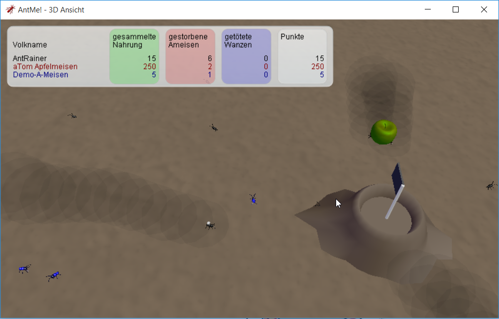
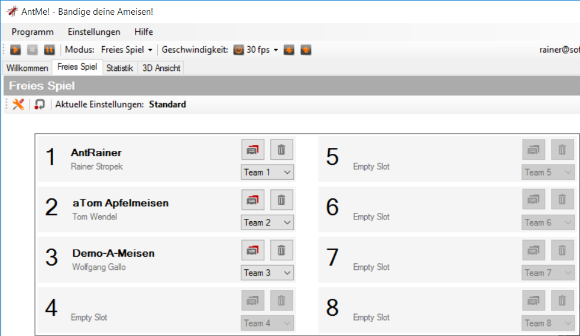

# AntMe! Wie schlau ist deine Ameise?

## Ziel der Übung

C# (Englisch "C Sharp") ist eine der meist verwendeten Programmiersprachen der Welt. Sie ist Open Source und plattformunabhängig. Mit C# werden verschiedenste Programme geschrieben: Spiele, wirtschaftliche Software, Webseiten und vieles mehr.

Ein Ziel dieser Übung ist es, dass du C# auf eine Weise kennenlernst, die Spaß macht. Dein Ziel wird es sein, in C# einen Computerspieler zu programmieren, der die Ameisen einer Ameisenkolonie steuert. Du lernst dabei nicht nur die Programmiersprache C# kennen, du musst dir auch einen schlauen Algorithmus für deine Ameisen überlegen.

In dieser Übung verwenden wir das Spiel [AntMe!](http://www.antme.net/de/).  

## Systemvoraussetzungen

Zum Programmieren mit C# und AntMe! brauchst du *Visual Studio* von *Microsoft*. Die Software gibt es als *Community Edition* zum [kostenlosen Download](http://www.visualstudio.com/de-de/downloads/download-visual-studio-vs.aspx). Brauchst du Hilfe beim Installieren von Visual Studio? Sag einer Mentorin oder einem Mentor Bescheid, sie helfen dir weiter.

Hast du kein Windows sondern einen Mac oder Linux? Sag einem Mentor beim CoderDojo bescheid. Sie können dir helfen, damit du auch dort AntMe! programmieren kannst.

## AntMe! installieren

1. Öffne als erstes die [Homepage von AntMe!](http://www.antme.net/de/) und schau dir das Video an. Dort lernst du die Grundidee von AntMe! kennen.

2. Lade dir die AntMe! Software herunter. Alle Links findest du im [AntMe! Wiki](http://wiki.antme.net/de/Lektion1).

3. Installiere AntMe! Das [AntMe! Wiki](http://wiki.antme.net/de/Lektion2) enthält auch dafür eine Anleitung. 

3. Starte AntMe! Eine Beschreibung findest du im [AntMe! Wiki](http://wiki.antme.net/de/Lektion3).

## Deine erste Ameise programmieren

1. Geh die [erste Programmierübung von AntMe!](http://wiki.antme.net/de/Lektion4) durch. Du erfährst darin die Grundlagen der "Ameisen-Programmierung".

2. Ameisen müssen auch kämpfen, um zu überleben. Käfer sind hinter ihnen her. In der [zweiten Übung von AntMe!](http://wiki.antme.net/de/Lektion5) lernst du, wie du deinen Ameisen beibringen kannst, zu überleben.

3. Deine Ameisen sind nicht auf sich alleine gestellt. Sie können mit anderen Ameisen über Duftstoffe kommunizieren. Wie das geht lernst du in der [dritten AntMe! Übung](http://wiki.antme.net/de/Lektion6).

4. Möchtest du, dass deine Ameisen schneller oder stärker sind? Du kannst das beeinflussen. Wie, das findest du in [Übung vier von AntMe!](http://wiki.antme.net/de/Lektion7) heraus.

## Kreativ sein und andere Coder herausfordern

1. Nach den Übungen kannst du beginnen, die Strategie deiner Ameisen weiter zu verbessern. Du kannst deinen Computerspieler gegen verschiedene Beispiel-Spieler antreten lassen, die AntMe! mitbringt. Wie schlagen sich deine Ameisen im Vergleich zu ihnen? 

2. Wenn mehrere Coder im Dojo AntMe! programmieren, könnt ihr eure eigenen Computerspieler gegeneinander spielen lassen. Wessen Ameisen schneiden am besten ab?

## Wie gehts weiter?

C# gefällt dir? Du möchtest mehr wissen?

1. Wenn du Lust hast kannst du einen kostenlosen [Online-Videokurs über C#](https://mva.microsoft.com/de-de/training-courses/programmieren-f-r-beginner-mit-c--10140?l=JqnuG5A6_9704984382) machen. Dabei lernst du die Programmiersprache von Grund auf Schritt für Schritt kennen.

2. Wenn du im CoderDojo bist, löchere deine Mentoren mit Fragen. In Linz haben wir bei paar echte C# Profis dabei, die in diesem Bereich weit über die Grenzen von Österreich hinaus bekannt sind.
