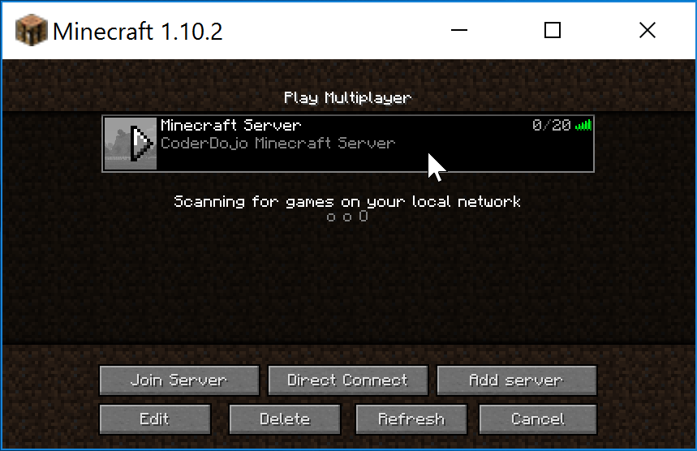

---

title: Minecraft Server für ScriptCraft
description: In dieser Anleitung lernst du, wie du einen Minecraft Server für ScriptCraft aufsetzt. 
---

# Minecraft Server für ScriptCraft

**Wichtiger Hinweis: Diese Anleitung ist für erfahrene Coder, Mentorinnen und Mentoren.** Wenn du im generellen Umgang mit Linux-Servern, Docker, JRE etc. noch unerfahren bist, bitte eine Mentorin aus dem CoderDojo, den Minecraft-Server für dich herzurichten. Später kannst du dich selbst am Installieren eines MineCraft-Servers wie hier beschrieben heran wagen.


## Einleitung

Ziel dieser Anleitung ist das Betreiben eines Minecraft Servers auf Basis von [Spigot](https://www.spigotmc.org/wiki/about-spigot/) mit installiertem [Scriptcraft](http://scriptcraftjs.org/) Mod zum Programmieren von [Minecraft](https://minecraft.net/de/) mit JavaScript.

Um möglichst wenig installieren zu müssen und mit wenig Ressourcen viele Server für ein CoderDojo betreiben zu können, verwenden wir [Docker](https://www.docker.com/) zum Isolieren der Serverinstanzen.


## Systemvoraussetzungen

Man braucht [Docker](https://www.docker.com/) für diese Anleitung:

* Unter Windows kann [Docker for Windows](https://docs.docker.com/engine/installation/windows/#/docker-for-windows) verwendet werden.
* Unter MacOS kann [Docker for Mac](https://docs.docker.com/engine/installation/mac/#/docker-for-mac) verwendet werden.
* Unter Linux kann Docker direkt verwendet werden (z.B. [Ubuntu](https://docs.docker.com/engine/installation/linux/ubuntulinux/))

Falls kein passender Rechner lokal zur Verfügung steht, ist die Verwendung eines Docker-Servers in der Cloud (z.B. [Docker auf Azure](https://github.com/Azure/azure-quickstart-templates/tree/master/docker-simple-on-ubuntu)) empfehlenswert.


## Basisimage

Als Basis wurde ein [Dockerfile für Spigot mit Scriptcraft](https://github.com/coderdojo-linz/coderdojo-linz.github.io/tree/master/trainingsanleitungen/minecraft-plugins/07_spigot_scriptcraft_docker/base-image/Dockerfile) erstellt. Es kann lokal wie folgt in ein Docker Image gebaut werden:

* Speichern des Dockerfiles in einem leeren Verzeichnis
* `docker build -t spigotmc .` (kann je nach bereits installierten Images und Internetanbindung etwas dauern)

In `docker images` müsste jetzt das neue Image `spigotmc` zu sehen sein.


## Images für Spielszenarien

Aufbauend auf dem Basisimage können jetzt individuelle Images für verschiedene Spielszenarien erstellt werden. Für diese Anleitung haben wir ein [Dockerfile für eine komplett flache Welt](https://github.com/coderdojo-linz/coderdojo-linz.github.io/tree/master/trainingsanleitungen/minecraft-plugins/07_spigot_scriptcraft_docker/flat-and-empty-world/Dockerfile) erstellt. Hier ein paar Hinweise dazu:

* Das Dockerfile kopiert eine [server.properties](https://github.com/coderdojo-linz/coderdojo-linz.github.io/tree/master/trainingsanleitungen/minecraft-plugins/07_spigot_scriptcraft_docker/flat-and-empty-world/server.properties)-Datei. Sie kann an die jeweiligen Bedürfnisse des Spielszenarios angepasst werden. Mehr zu *server.properties* findet man [im Minecraft Wiki](http://minecraft-de.gamepedia.com/Server.properties).
* Das Dockerfile kopiert eine [ops.json](https://github.com/coderdojo-linz/coderdojo-linz.github.io/tree/master/trainingsanleitungen/minecraft-plugins/07_spigot_scriptcraft_docker/flat-and-empty-world/server.properties)-Datei. Man kann in ihr Benutzer speichern, die von Haus aus *Operators* sein sollen. Mehr dazu findet man [im  Minecraft Wiki](http://minecraft-de.gamepedia.com/Server.properties#ops.json).

Ein Dockerfile für ein Spielsenario kann lokal wie folgt in ein Docker Image gebaut und gestartet werden:

* Speichern des Dockerfiles mit *server.properties* und *ops.json* in einem leeren Verzeichnis
* Image bauen: `docker build -t mc-flat-empty .` (geht sehr schnell)
* Container starten: `docker run -it --rm -p 25565:25565 --name mc-flat-empty -v C:\scriptcraft\flat-and-empty-world\plugins:/bin/spigotmc/scriptcraft/plugins/rainer mc-flat-empty`
  * `-it --rm` sorgt dafür, dass der Container interaktiv gestartet wird (Console kann beobachtet werden) und beim Beenden des Servers automatisch gelöscht wird.
  * `p 25565:25565` gibt den Minecraft Standardport am Docker Host frei. Will man mehrere Minecraft Server betreiben, kann man den Port z.B. mit `-p 25566:25565` auf *25566* ändern.
  * `--name ...` vergibt einen Namen für den Container.
  * `-v <local-dir>:/bin/spigotmc/scriptcraft/plugins/<some-folder-name>` mapped ein lokales Verzeichnis mit in JavaScript geschriebenen Mods in den Minecraft Container.
  * `mc-flat-empty` ist der Name des oben erstellten Docker Image für das Spielsenario.

Hat man alles richtig gemacht, sieht das so aus:

```
C:\temp\scriptcraft\flat-and-empty-world>docker build -t mc-flat-empty .
Sending build context to Docker daemon 8.704 kB
Step 1 : FROM rstropek/spigotmc
 ---> 4a6020e36757
Step 2 : COPY server.properties /bin/spigotmc
 ---> Using cache
 ---> 925c920abd91
Step 3 : COPY ops.json /bin/spigotmc
 ---> Using cache
 ---> 414acf0ebf53
Step 4 : CMD /bin/spigotmc/start.sh
 ---> Using cache
 ---> f4d15115f8fe
Successfully built f4d15115f8fe
SECURITY WARNING: You are building a Docker image from Windows against a non-Windows Docker host. All files and directories added to build context will have '-rwxr-xr-x' permissions. It is recommended to double check and reset permissions for sensitive files and directories.

C:\temp\scriptcraft\flat-and-empty-world>docker run -it --rm -p 25565:25565 --name mc-flat-empty -v C:\scriptcraft\flat-and-empty-world\plugins:/bin/spigotmc/scriptcraft/plugins/rainer mc-flat-empty
Loading libraries, please wait...
[07:42:49 INFO]: Starting minecraft server version 1.10.2
[07:42:49 INFO]: Loading properties
[07:42:49 INFO]: Default game type: CREATIVE
[07:42:49 INFO]: This server is running CraftBukkit version git-Spigot-72c2605-709783c (MC: 1.10.2) (Implementing API version 1.10.2-R0.1-SNAPSHOT)
...
[07:42:57 INFO]: [scriptcraft] Unzipping /bin/spigotmc/scriptcraft/modules/watcher.js (NE)
[07:42:58 WARN]: [scriptcraft] cow-clicker minigame is not yet supported in CanaryMod and Craftbukkit
[07:42:59 WARN]: [scriptcraft] Legacy ScriptCraft directory /bin/spigotmc/plugins/scriptcraft was found. This directory is no longer used.
[07:42:59 WARN]: [scriptcraft] Please put plugins in the /bin/spigotmc/scriptcraft/plugins directory
[07:42:59 INFO]: [scriptcraft] Please note that the working directory for scriptcraft v3.2.0-2016-03-19 is /bin/spigotmc/scriptcraft
[07:42:59 INFO]: Done (9.687s)! For help, type "help" or "?"
[07:42:59 INFO]: [scriptcraft] js-patch setTimeout() test complete
>
```

Jetzt kann man sich zum Server in Minecraft verbinden:




## Ressourcen zum Thema Scriptcraft

* [Scriptcraft Homepage](http://scriptcraftjs.org/)
* [Scriptcraft Guide](https://github.com/walterhiggins/ScriptCraft/blob/master/docs/YoungPersonsGuideToProgrammingMinecraft.md)
* [Beispiele aus dem Scriptcraft Buch](https://github.com/walterhiggins/Writing-Minecraft-Plugins)
* [Scriptcraft Source auf GitHub](https://github.com/walterhiggins/ScriptCraft)
