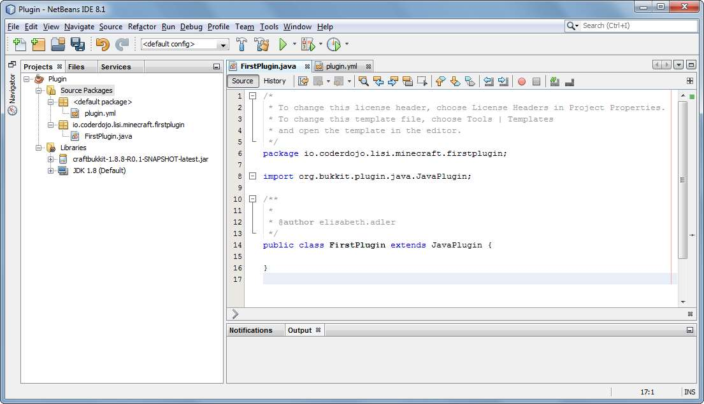

---

title: NetBeans Projektsetup
description: Eine Kurzanleitung für das Anlegen eines neuen NetBeans Projekts
---

# NetBeans Projektsetup

Kurzanleitung, wie das Projekt in NetBeans aufgesetzt werden muss, um für deine Minecraft Plugins vorbereitet zu sein.

## Projekt erstellen

1. NetBeans starten
1. Menü **File** > Menüpunkt **New Project ...**
1. Auswahl: Categories **Java**, Projects **Java Class Library** > Klick auf **Next**
1. Vergabe des Projektnamens unter **Project Name** (z.B. FirstPlugin) > Klick auf **Finish**

## Craftbukkit Bibliothek hinzufügen

1. Auf der linken Seite (Tab **Projects**) auf **Libraries** mit der rechten Maustaste klicken > **Add JAR/Folder** auswählen.
1. Die Datei **craftbukkit.jar** auswählen > Klick auf **Open**

## Package hinzufügen

1. Auf der linken Seite (Tab **Projects**) auf **Source Packages** mit der rechten Maustaste klicken > **New** auswählen > **Java Package** auswählen.
1. Als **Package Name** folgendes vergeben: io.coderdojo.<deinName>.minecraft.<pluginName> (wobei <deinName> sowie <pluginName> in Kleinschreibung ersetzt wird, z.B. durch "lisi" und "firstplugin") > Klick auf **Finish**

## Hauptklasse hinzufügen
1. Auf der linken Seite (Tab **Projects**) in **Source Packages** auf dein neu erstelltes Package mit der rechten Maustaste klicken > **New** auswählen > **Java Class** auswählen.
1. Als **Class Name** dein Plugin benennen, z.B. FirstPlugin > Klick auf **Finish**
1. Sicherstellen dass nach dem Klassennamen `extends JavaPlugin` steht.

##  plugin.yml hinzufügen
1. Auf der linken Seite (Tab **Projects**) auf **Source Packages** mit der rechten Maustaste klicken > **New** auswählen > **YAML File** auswählen.
1. Als **File Name** den Namen `plugin` eingeben > Klick auf **Finish**

##  Resultat
Dein Projektsetup sollte jetzt so aussehen:

##  Projekt bauen und deployen
1. In der Icon Leiste oben auf den Hammer **Build Project (F11)** klicken.
1. Im Fenster **Output** (wenn nicht vorhanden, über Menüpunkt **Window** > **Output (Strg+4)** anzeigen lassen) den Pfad zum *.jar kopieren (endet auf `dist/`).
1. Im Explorer die `*.jar` Datei aus `dist/` in den Server Plugins Ordner (`craftbukkit/plugins/`) kopieren.
1. In der Server Konsole das Kommando `reload` eingeben.

