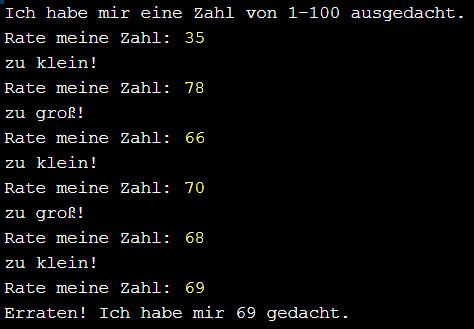

# Zahlen raten mit Python

Wollen wir ein Programm für das Spiel "Zahlen raten" schreiben?
Der Computer denkt sich eine Zahl im Bereich von 1 - 100 und der Spieler soll diese erraten. 
Nach jedem Versuch gibt das Programm aus, ob die eingegebene Zahl zu klein, zu groß
oder richtig war.

# Allgemeines zur Programmiersprache Python
Wir verwenden für die Programmierung die Programmiersprache Python (siehe die Python Homepage [www.python.org](https://www.python.org/)),
genauer gesagt Python 3, also eine Version von Python, deren Bezeichnung mit 3 beginnt, z.B. Python 3.7.1.
Zu Beginn ist es am einfachsten, wenn du Python-Programme online im Browser (z.B. auf [www.onlinegdb.com/online_python_interpreter](https://www.onlinegdb.com/online_python_interpreter))
entwickelst und ausführst. 
Wenn du Python-Programme lokal auf einem Rechner entwickeln und laufen lassen möchtest, muss Python installiert sein. 
Hilfe dazu findest du auf der [Python Homepage](https://www.python.org/about/gettingstarted/) und im Python Wiki (siehe [wiki.python.org](https://wiki.python.org/moin/BeginnersGuide/Download)).

Achtung: Nicht alle Computersysteme und Programme können automatisch mit deutschen Sonderzeichen 
umgehen, oder verarbeiten sie unterschiedlich.
Da wir hier z.B. den Buchstaben 'ß' verwenden wollen, kann es zu Fehlermeldungen
kommen, die z.B. so aussehen:

```none
SyntaxError: Non-UTF-8 code ...
```

In diesem Fall kann man versuchen, sicher zu stellen, dass die Programmdatei mit
UTF-8 Codierung abgespeichert wird. Oder man vermeidet die Sonderzeichen durch Umschreibung (z.B. 'ss' statt 'ß').


# Eine Zahl ausdenken
Wie kann sich ein Computerprogramm eine Zahl ausdenken? 
Wir könnten einfach einer Variable, sagen wir `n`, 
eine Zahl zuweisen, die erraten werden soll:

```python
  n = 42
```

Wenn das Programm für unser Spiel läuft, ist diese Zahl nicht sichtbar
und der Spieler muss sie wirklich erraten. 
Allerdings wird der Spieler schnell herausfinden, dass immer die Zahl
42 zu erraten ist, und das Interesse an unserem Spielprogramm verlieren.

Wie kann man für jedes Spiel eine neue Zahl erzeugen? 
Am einfachsten ist die Verwendung eines (Pseudo-)Zufallsgenerators:

```python
  from random import randint
  n = randint(1,100)
```

Die Variable `n` hat jetzt einen zufälligen Wert im Bereich von 1 - 100.
(Wobei "zufällig" nicht ganz stimmt: die erste Zufallszahl nach dem Programmstart wird basierend auf 
der aktuellen Zeit bestimmt. Jede weitere Zufallszahl innerhalb
eines Programmlaufs wird mit einer komplizierten Formel aus der vorhergehenden berechnet.)

Das Programm sollte jetzt noch mitteilen, dass es eine Zahl gewählt hat:

```python
  print('Ich habe mir eine Zahl von 1-100 ausgedacht.')
```


# Einen Rateversuch abfragen

Jetzt ist der Spieler an der Reihe. 
Dazu muss das Programm einen Rateversuch abfragen. Das geht am einfachsten
mit der Funktion `input`, die Texteingaben mittels Tastatur entgegennimmt.
Die Eingabe muss mit der Eingabetaste abgeschlossen werden.

Als Argument kann man der Funktion `input` einen Text
mitgeben, damit der Spieler weiß, was von ihm erwartet wird.
Der Rückgabewert der Funktion ist die Eingabe des Spielers.

```python
  versuch = input('Rate meine Zahl: ')
```

Einen wichtigen Punkt müssen wir hier noch beachten: 
die Funktion `input` liefert einen Text, also einen Wert vom Typ `str`
("string"). Wenn der Benutzer bei obiger Codezeile also z.B. 99 eingegeben hat,
dann würden wir in der Variable `versuch` den String `'99'` halten und nicht die Zahl `99`.
Zum Glück ist eine Umwandlung in eine Zahl in Python sehr einfach:
wir brauchen den String nur an die Funktion `int` zu übergeben. 
Damit sieht unsere Codezeile zum Abfragen des Rateversuchs so aus:

```python
  versuch = int(input('Rate meine Zahl: '))
```


# Den Versuch auswerten

Um zu entscheiden, ob der Spieler die Zahl erraten hat, 
müssen wir auf Gleichheit zwischen der gedachten Zahl,
die wir uns in der Variable `n` gemerkt haben, und der 
eingegebenen Zahl, die wir in der Variable `versuch`
abgelegt haben, prüfen. Dazu muss man in Python den Operator `==` verwenden:

```python
  if versuch == n: 
      print('Erraten! Ich habe mir %d gedacht.' % n)
```

Wenn die gedachte Zahl nicht erraten wurde, wollen wir
einen Hinweis geben:


```python
  if versuch < n: print('zu klein!')
  if versuch > n: print('zu groß!')
```


# Die Spielschleife

Das Programm soll solange nach neuen Rateversuchen fragen,
bis die gedachte Zahl erraten wurde. Dazu können wir das
Abfragen und Auswerten in eine Endlosschleife packen (`while True: ...`),
die bei Erfolg abgebrochen wird (`break`). 
Insgesamt sieht unsere Spielschleife dann so aus:

```python
  while True:
      versuch = int(input('Rate meine Zahl: '))
      if versuch == n: 
          print('Erraten! Ich habe mir %d gedacht.' % n)
	      break
      if versuch < n: print('zu klein!')
      if versuch > n: print('zu groß!')
```


# Das gesamte Programm


```python
  from random import randint
  n = randint(1,100)
  print('Ich habe mir eine Zahl von 1-100 ausgedacht.')
  
  while True:
      versuch = int(input('Rate meine Zahl: '))
      if versuch == n: 
          print('Erraten! Ich habe mir %d gedacht.' % n)
	      break
      if versuch < n: print('zu klein!')
      if versuch > n: print('zu groß!')
```

Ein Spielverlauf könnte dann so aussehen:




# Erweiterungsmöglichkeiten

Willst du das Programm noch ausbauen? Folgende Ideen dazu:

* Zu Beginn könnte das Programm abfragen, bis zu welcher Größe die gedachte Zahl sein soll.
* Bei einer leeren Eingabe könnte das Programm fragen, ob man aufgeben möchte,
  und die gedachte Zahl verraten.

### Aufgabe für Fortgeschrittene
**Rollen tauschen:** schreibe ein Programm, das versucht, die vom Menschen
gedachte Zahl zu erraten! (siehe dazu auch [Zahlenraten, zweiter Teil](python-zahlenraten-2.html))
