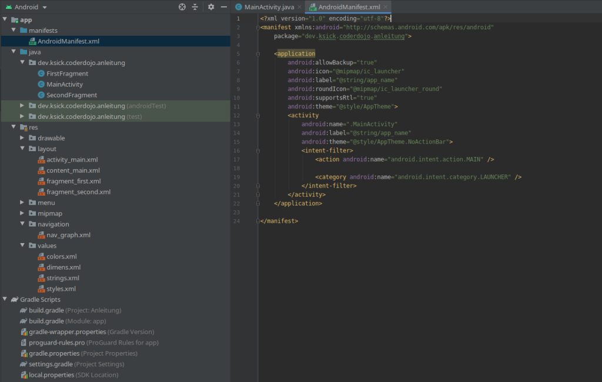

# Android Map Reactions App

In dieser Übung programmierst du eine Android App in Java. In dieser App kann man einen Satz eingeben, der dann (phonetisch auf Orte übersetzt) als Route auf einer Karte angezeigt wird. Die Idee dazu basiert auf diesem [Comic Strip](https://xkcd.com/2260/). Während der Entwicklung der App wirst du lernen, wie man eine einfache Android App inklusive Navigation zwischen Screens schreibt. Außerdem wirst du über sogenannte REST Calls mit einem Server über das Internet kommunizieren, um den eingegebenen Satz in eine Route zu verwandeln. Zu guter letzt wird diese Route dann mithilfe von [Open Street Map](https://www.openstreetmap.org/) auf einer Karte angezeigt.

## Voraussetzungen

- Etwas Programmiererfahrung
- Ein Smartphone mit Android 5.0 oder höher ([So findest du die Android Version deines Smartphones](https://support.google.com/android/answer/7680439?hl=de)). Alternativ kannst du auch einen [Emulator](https://developer.android.com/studio/run/emulator) verwenden
- Ein Kabel um dein Smartphone mit dem Computer zu verbinden (falls du dein Smartphone verwendest)
- [Android Studio](https://developer.android.com/studio/install)

## App erstellen und ausführen

Befolge diese Schritte um die App zu erstellen:

1. Starte Android Studio
2. Erstelle mit `File` -> `New` -> `New Project` ein neues Projekt
3. Wähle eine `Basic Activity` als `Project Template` aus
4. Gib die folgenden Dinge ein
	* `Name`: Der Name deiner App - ich nenne meine zum Beispiel `Map Reactions`
	* `Package name`: Ein eindeutiger Name um deine App im Google Play Store zu identifizieren. Für die Anleitung ist es ganz egal welchen Namen du verwendest
	* `Save location`: Der Ordner in dem du das Projekt speichern möchtest
	* `Language`: Native Android Apps kann man in Java oder Kotlin programmieren. In dieser Anleitung werde ich Java verwenden, du kannst aber gerne auch Kotlin ausprobieren
	* `Minimum SDK`: Die niedrigste Android Version die von der App unterstützt wird. Wähle hier `API 21: Android 5.0 (Lollipop)` aus
5. Klicke auf `Finish` 

Um die App auf deinem Handy auszuführen, musst du zuerst die Entwickler Optionen und USB-Debugging aktivieren. Das geht mit den folgenden Schritten.

1. Öffne die Einstellungen auf deinem Android Smartphone
2. Klick auf `Telefoninfo`
3. Klick 7 mal auf `Build-Nummer` um die Entwickler Optionen zu aktivieren
4. Gehe zurück zu den Einstellungen und klick auf `Entwickler Optionen`
5. Aktiviere `USB-Debugging`

Falls du es noch nicht getan hast, solltest du jetzt dein HSmartphoneandy mithilfe eines USB-Kabels mit deinem Computer verbinden. Dann sollte ein Dialog mit dem Titel `USB-Debugging zulassen` am Smartphone erscheinen. Bestätige diesen mit `Erlauben`.

Jetzt kannst du wieder zurück zu Android Studio wechseln und die App ausführen. Wähle dazu dein Smartphone aus (falls es nicht schon automatisch ausgewählt wurde) und klicke dann auf den grünen `Play` Button neben dem Dropdown. Jetzt sollte die App auf deinem Smartphone ausgeführt werden. 

### Was beinhaltet diese App?

Im oben beschriebenen Schritt hat uns Android Studio eine App mit einer `Basic Activity` generiert. Sehen wir uns mal an, was diese beinhaltet.

- `manifests`
Enthält die `AndroidManifest.xml` Datei
	- `AndroidManifest.xml`
	Diese Datei muss in jeder Android App vorhanden sein. Sie enthält Informationen über die App, wie zum Beispiel Name, Activities (sind im nächsten Punkt beschrieben) oder Permissions (Rechte, die die App anfragen muss). Jede Activity der App muss hier beschrieben sein. Interessant ist auch der `intent-filter` in der `MainActivity`. Dieser ist dafür verantwortlich, dass das Betriebssytem weiss, welche Activity beim Starten der App angezeigt werden soll.
- `java`
  Enthält alle Java Dateien und Tests
  - `MainActivity.java`
	Eine Activity ist repräsentiert im Prinzip eine Bildschirmseite (einen Screen) in einer App. Sie kann Elemente wie Buttons, Text- & Eingabefelder, aber auch Fragments  (siehe nächster Punkt) beinhalten. Beim Erstellen einer App generiert Android automatisch die `MainActivity.java`, welche auch gleich ins `AndroidManifest.xml` eingetragen wird.
  - `FirstFragment.java` & `SecondFragment.java` 
	 Ein Fragment ist ein wiederverwendbares Element einer Activity. So kann man beispielweise auf einem Tablet zwei Fragments nebeneinander anzeigen, während man auf einem Smartphone immer nur eines anzeigt. Das `FirstFragment` ist in diesem Fall das erste Fragment, das man sieht wenn man die App öffnet. Klickt man auf den `NEXT` Button wird das `SecondFragment` angezeigt.
- `res`
  Enthält alle Resourcen die keinen Programmcode enthalten wie zum Beispiel Bilder, Texte oder Layouts
  - `drawable`
    Hier können verschiedene Arten von Grafiken abgelegt werden
  - `layout`
    In diesem Ordner werden die Layout Dateien abgelegt, die bestimmen wie die Benutzeroberfläche der App aussieht
  - `menu`
    Hier werden Dateien gespeichert, die definieren wie die Menüs aussehen und welche Elemente sie beinhalten
  - `mipmap`
    Dieser Ordner beinhaltet das Launcher Icon (App Icon)
  - `navigation`
    Enthält den Navigation graph, welcher alle Informationen über die Navigation in der App beschreibt 
  - `values` 
    Hier werden XML Dateien die einfache Werte enthalten abgelegt. Das sind zum Beispiel Farben oder Texte

Ganz unten sieht man noch den Abschnitt `Gradle Scripts`. Dieser beinhaltet alles rund um das Build Management-Tool Gradle. Dieses kümmert sich um die Kompilierung des Quellcodes und die Resourcen der App und generiert anschließend eine APK (Android Application Package) Datei, die dann auf einem Smartphone installiert werden kann. Hier sind vor allem die zwei `build.gradle` Dateien wichtig. Die `build.gradle` Datei auf Projektebene (erkennt man am `(Project: Anleitung)` hinter dem Dateinamen) gibt die Build-Anweisungen für das gesamte Projekt vor, ist im Rahmen dieser Anleitung aber nicht so wichtig. Für uns ist die `build.gradle (Module: app)`  viel wichtiger. Sie enthält die Build-Anweisungen und die Bibliotheken (libraries), welche in der App eingebunden sind.

  

## Phrase/Satz eingeben

### Layout

### Input einlesen

### Zum nächsten Fragment wechseln & input/phrase übergeben

## Karte anzeigen

### Basic TextView Layout

### input argument holen und route fetchen

### route parsen

### karte mit markern anzeigen

### route anzeigen

## Bonus: Verbesserungen

### Input validation

### Network on main thread

### UI

### Lambda warmup